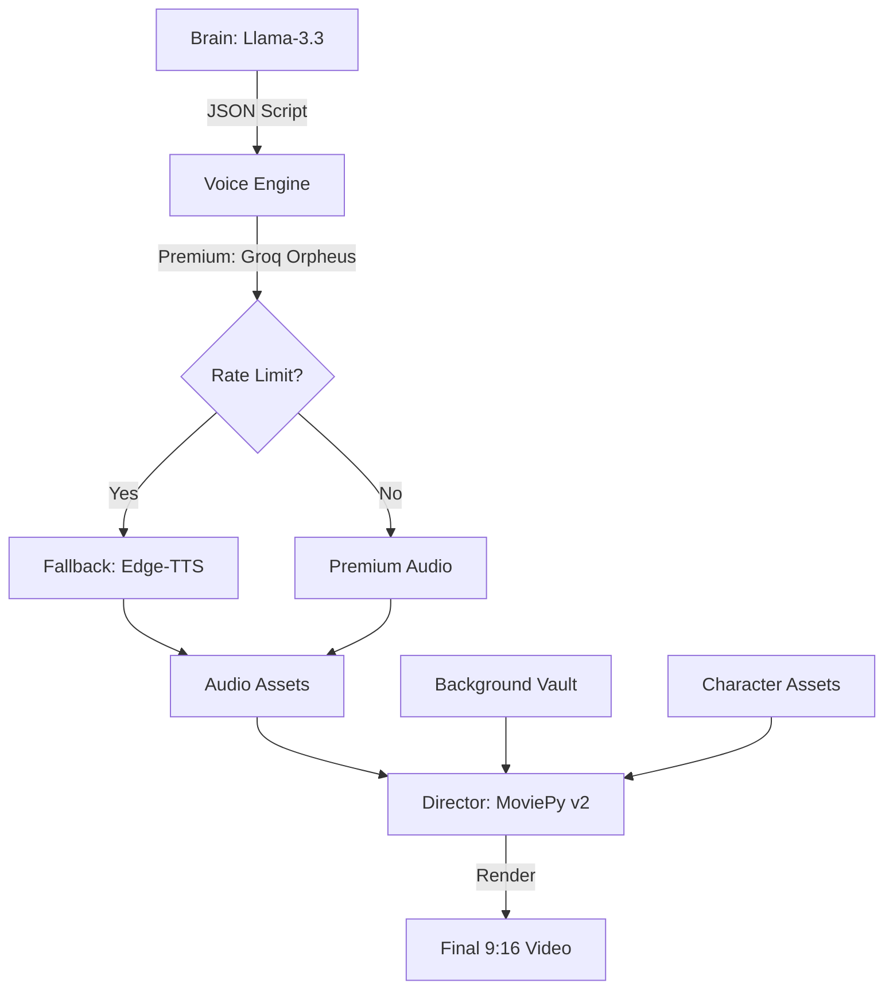

# 🎬 Script-to-Video-AI-Generator: Resilient Short-Form Content Factory

[](https://www.python.org/downloads/)
[](https://opensource.org/licenses/MIT)
[](https://zulko.github.io/moviepy/)

**Script-to-Video-AI-Generator** (Internal Code: *Nexus Core*) is a high-performance, fully autonomous pipeline designed for mass-producing viral 15-20 second vertical "Short" format tech debates. Engineered for maximum resilience, it features a unique Hybrid TTS architecture that ensures zero production downtime.

---

## 🚀 Key Features

### 🧠 Intelligent Brain (Llama-3.3)
- Generates high-tension, retention-optimized technology debates.
- Custom "Viral Master Prompt" technology focuses on niche tech topics with aggressive character personas.

### 🎙️ Resilient Hybrid Voice Engine
- **Premium Tier:** Leverages Groq Orpheus TTS for high-fidelity emotional audio.
- **Fail-Safe Tier:** Automatically detects API rate limits and switches to high-quality Microsoft Neural (Edge-TTS) voices.
- **ASCII Sterilization:** Built-in sanitization to prevent encoding glitches in captions and audio synthesis.

### 🎬 Ultra-Light Director (MoviePy v2)
- **Memory-Safe Rendering:** Optimized for Windows environments using explicit garbage collection and 540p downscaling.
- **Variety Engine:** Time-based randomization and "Forced Variety" logic ensures alternating background footage and character poses.
- **Classic Viral Aesthetics:** High-readability bold yellow captions with drop shadows for maximum viewer retention.

---

## 📋 Prerequisites

Before running the engine, ensure you have the following installed:

1.  **Python 3.10+:** [Download here](https://www.python.org/downloads/)
2.  **FFmpeg:** (Critical for video rendering)
    -   **Windows:** `winget install ffmpeg`
    -   **Mac:** `brew install ffmpeg`
    -   **Linux:** `sudo apt install ffmpeg`
3.  **Groq API Key:** Obtain a free key from [Groq Console](https://console.groq.com/).

---

## 🏗️ Technical Architecture



---

## 📁 Project Structure

```text
├── engine/                # Core Logic (Brain, Voice, Director)
├── assets/                # Raw Media Assets
│   ├── background_videos/ # Viral gameplay/satisfying footage
│   └── characters/        # Alex & Sarah pose folders
├── scripts/               # Production Scripts
│   └── scripts_to_render/ # Drop your JSON scripts here
├── data/
│   ├── audio/             # Generated voice assets
│   └── videos/            # FINAL RENDERED OUTPUT
├── .env                   # Your private API keys (Hidden)
├── mass_producer.py       # The Main Factory Script
└── requirements.txt       # Python dependencies
```

---

## 🎨 Asset Management

### Characters
Place transparent `.png` character poses in `assets/characters/Alex/` and `assets/characters/Sarah/`. The engine's **Variety Logic** will randomly select different poses for every video to maintain visual interest.

### Backgrounds
Place vertical or horizontal 9:16 gameplay clips in `assets/background_videos/`. The engine will automatically crop, resize, and stabilize footage to match the "High-Energy" viral aesthetic.

---

## 🛠️ Installation & Setup

### 1. Clone the Repository
```bash
git clone https://github.com/Ahmadshahzad1424/Script-to-Video-AI-Generator.git
cd Script-to-Video-AI-Generator
```

### 2. Install Dependencies
```bash
pip install -r requirements.txt
```

### 3. Environment Configuration
Create a `.env` file in the root directory:
```env
GROQ_API_KEY=your_gsk_key_here
```

---

## 🏭 Mass Production Usage

To start a high-volume batch render, simply drop your `.json` scripts into the `scripts_to_render/` folder and run:

```bash
python mass_producer.py
```

The system will automatically:
1. Orchestrate the script batch.
2. Generate resilient audio assets.
3. Render polished MP4s to the `data/videos/` directory.

---

## 🛡️ Security & Performance
- **Zero-Key Leakage:** All API keys are handled via environment variables and protected by `.gitignore`.
- **RAM Efficiency:** Explicitly designed to prevent memory paging errors on standard Windows hardware.
- **Codec Stability:** Outputs in `yuv420p` to ensure universal playback on TikTok, YouTube Shorts, and Instagram Reels.

---

## 🗺️ Roadmap
- [ ] **Phase 5:** Automated Audio Ducking for background music.
- [ ] **Phase 6:** Cinematic Ken Burns background movement.
- [ ] **Phase 7:** Direct Cloud Upload (TikTok/YT API integration).

---

## 📄 License
This project is licensed under the MIT License - see the LICENSE file for details.

---
**Maintained by:** Ahmad Shahzad  
**Status:** Production Ready | Resilient Edition
