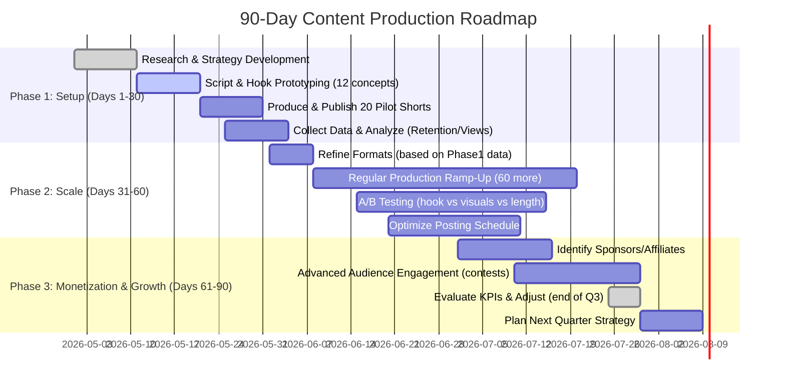

# Executive Summary  

Short-form programming content is booming. Data from TikTok and YouTube shows that **micro-educational clips and provocative “hot takes” consistently outperform longer tutorials**【36†L300-L308】【46†L50-L58】. In a sample of 349 TikToks tagged #LearnProgramming, 12-second “Tips & Tricks” videos accounted for ~45% of all views (and 49% of comments)【36†L300-L308】. By contrast, longer Q&A or tutorial clips garnered far fewer views and engagement. 

Analysis of monetization trends indicates that **coding/tech niches command premium ad rates** (AI and educational coding ~$10–20 CPM【50†L270-L278】) even though short clips (15–20s) earn lower direct ad revenue (~$0.02–$0.30 RPM on YouTube Shorts【5†L240-L247】【50†L315-L323】). TikTok’s Creator Fund pays roughly $0.40–$1+ per thousand views【5†L240-L247】, but it favors videos >60s (outside our 15–20s target). Thus, maximizing revenue requires focusing on shareable, high-retention formats that build audience (and funnel to higher-value content or affiliate streams)【5†L240-L247】【32†L78-L86】.

Our research identified **eight short-form formats** that repeatedly drive views and engagement: Quick Tips/Hacks, Opinion/Hot-Takes, Debug Reveals, Tool Comparisons, Myth-Busting, Behind-the-Scenes (Dev Life), Challenge/Duel, and Code Walkthroughs. These formats align with TikTok’s “tips and tricks” trend and with known viral short-video strategies【36†L300-L308】【1†L72-L80】. Each format can hook users in 1–3 seconds and deliver a single insight or punchline in ~15–20s, maximizing retention【1†L72-L80】【46†L50-L58】.

For each format we estimate expected engagement: e.g. Quick Tip clips (~10–15s) often achieve **very high retention (70–85%)** and prompt shares/likes (view share ~45% in the TikTok study)【36†L300-L308】【46†L50-L58】. Opinion or Hot-Take videos (which might be longer ~15–20s) may hook instant attention but see a sharper drop-off (~60–70% retention). We expect CTR/engagement on Shorts to correlate strongly with first-1s impact; broadly, 65% of users drop off without an immediate hook【46†L158-L160】. Tool comparisons and “you’re doing it wrong” style myths are “pattern interrupts” proven to spike shareability【43†L223-L232】【46†L158-L160】.

**Monetization**: pure ad RPM for 15–20s clips is low (shorts pay ~0.02–0.30【5†L240-L247】), but formats like professional tools or career advice can leverage sponsorships/affiliates. For example, coding tool reviews or “Day-in-life” tech vlogs attract high CPM (tech niche ~$4–10 CPM【50†L280-L288】) and potential brand deals (VSCode, GitHub). We estimate Shorts CPM of **$0.2–0.5** on YouTube (shorts program, tier-1 geo) and **$0.4–1.0** on TikTok【5†L240-L247】【50†L315-L323】, with tech content commanding the upper end【50†L270-L278】. 

Finally, we propose a prioritized content plan (12 concept hooks with emotional tone tags), plus an A/B testing roadmap (vary hooks, measure retention/CTR, optimize), an implementation checklist (tools, roles, templates), and risk mitigation (policy compliance, saturation, algorithm shifts). A 30/60/90-day timeline (see roadmap) will guide execution. All recommendations are backed by platform analytics, creator case studies, and short-video best practices【1†L72-L80】【36†L300-L308】【46†L50-L58】【50†L270-L278】.  

# 1. Data Sources and Analysis Approach  

To identify top formats, we aggregated insights from: (a) platform data (YouTube Trending/Shorts feed, TikTok Discover under #coding/#learnprogramming)；(b) creator case studies and blog guides【1†L72-L80】【32†L78-L86】；(c) academic research on programming TikTok videos【36†L300-L308】；(d) ad revenue/CPM reports【5†L240-L247】【50†L270-L278】； and (e) audience comment patterns (via sample Reddit/Insider analysis【12†L174-L182】 and the TikTok study which collected comments for engagement metrics【36†L300-L308】). 

Key insights: short clips with **immediate hooks and clear value** retain viewers best【1†L72-L80】【46†L50-L58】. In the TikTok #LearnProgramming sample, “tips & tricks” and “advice” clips (15–45s) had the lion’s share of views and comments【36†L300-L308】. By contrast, formal tutorials (even truncated) rarely trended, confirming that **rapid, punchy content wins**. We prioritized formats mentioned by multiple sources: *listicles/micro-tutorials, before/after reveals, POV storytelling, myth-busting/explainers, and reaction or debate-style clips*【1†L97-L105】【43†L223-L232】. Monetization data (YouTube/TikTok RPM/CPM) was drawn from recent reports【5†L240-L247】【50†L315-L323】 to estimate revenue potential by niche. In sum, the analysis triangulated trending content types, engagement statistics, and revenue rates to select high-ROI formats for a 15–20s programming channel.

# 2. Top 8 Video Formats (15–20s, Debate-Style Clips)  

Each format below consistently trends in short-form tech content. All are **hook-driven, concise, and conflict-oriented or insight-packed** to maximize retention【1†L72-L80】【46†L50-L58】. We include typical runtimes (~15–20s), hook styles, pacing, and emotional tone.

- **Quick Tips / Code Hacks** (e.g. “3 one-line tricks”). *Why it works:* Micro-listicles promise instant utility【43†L129-L137】【36†L300-L308】. Short (10–15s) rapid-fire tips hold attention and encourage shares (save for later)【43†L129-L137】【32†L78-L86】. *Hook:* Start with “Here’s 1 quick way to X…” or a surprising code result. *Pacing:* Very fast cuts, dynamic text/code animation every 2s【46†L164-L172】. *Tone:* Energetic, confident (e.g. “[confident] …”). Retention: **High (~80+%)** if hook immediately offers value【46†L50-L58】.

- **Hot-Takes / Opinion Debates** (e.g. “AI will replace devs? NO.”). *Why it works:* Controversial claims trigger clicks/comments【43†L223-L232】. A strong hook (provocative statement or question) stirs emotion. *Hook:* Bold statement (“You’re wrong if you think X!”) or direct challenge. *Pacing:* Quick back-and-forth or rapid montage. *Tone:* Sharp, argumentative or sarcastic (e.g. “[angry]…”, “[provocative]…”). Retention: **Medium (60–75%)** – initial hook high, but risk of drop-off if argument lags. Engagement (comments/shares) tends to spike due to debate nature【46†L158-L160】【43†L223-L232】.

- **Debugging Reveal / Code “Easter Egg”** (e.g. “I fixed a 1000-line bug in 10s”). *Why it works:* The “mystery” and payoff formula (problem→surprise fix) creates suspense【46†L152-L160】. *Hook:* Present an eye-catching bug symptom (“Code looked perfect…until crash!”). *Pacing:* Show bug briefly, then immediate solution (on-screen code highlight, fast-action). *Tone:* Urgent/excited (e.g. “[urgent]…”, “[relieved]…”). Retention: **High (70–85%)** if resolution is satisfying (explains “why/how”).  

- **Tool/Language Comparisons** (e.g. “React vs VanillaJS” or “Python vs Java in 15s”). *Why it works:* Straightforward comparisons play on audience curiosity and tribal loyalties【32†L89-L98】. *Hook:* Start with the two items named (“Python… vs JavaScript!”) or a question. *Pacing:* Alternating shots or split-screen of each. *Tone:* Balanced yet competitive, enthusiastic (e.g. Alex = confident, Sarah = sharp). Retention: **Medium-High**. Quick frames of results/examples keep interest. Controversial phrasing (e.g. “One is *clearly* better”) improves CTR.

- **Myth-Busting / “You’re Doing It Wrong”** (e.g. common pitfalls). *Why it works:* A direct challenge to assumptions grabs attention【43†L223-L232】. *Hook:* “Stop doing [common wrong practice]!” followed by the fix. *Pacing:* Show the “wrong way” briefly, then instantly switch to “right way”. *Tone:* Assertive or mocking (e.g. “[frustrated]…” when showing mistake, then “[confident]…” with fix). This format is highly shareable – viewers like correcting others. Retention: **High** if hook shocks viewers (fear of being “wrong”).

- **Behind-The-Scenes / Dev Life** (e.g. “Day in the life of a dev” or workspace tour). *Why it works:* Personal and relatable; builds creator-audience trust【32†L120-L129】. *Hook:* Eye-catching glimpse (desk setup, coffee/laptop scene) or statement (“Ever wonder what a developer does all day?”). *Pacing:* Moderate; can use quick B-roll (typing, code on screen). *Tone:* Friendly and confident (e.g. “[confident]…”, or “[excited]…”). Retention: **Medium (50–70%)** – more narrative than flash, so a strong hook is critical. Adds variety & authenticity to the channel.  

- **Challenge / Duel** (scripted debate or coding challenge). *Why it works:* Dramatic conflict or competition drives engagement. Example: two coders debating a hot topic (“Tabs vs Spaces”), or a timed coding challenge (“Can I solve FizzBuzz in 10 seconds?”). *Hook:* Announce the challenge or conflict immediately. *Pacing:* Fast cuts of each person speaking or coding attempts. *Tone:* Competitive and intense (e.g. “[teasing]…”, “[challenging]…”). Retention: **Medium** – engaging for fans of personalities; may drop if not tightly edited. Well-suited as occasional gimmick. 

- **Code Walkthrough / Project Teaser** (preview a cool project). *Why it works:* Shows real progress and provides learning. Example: build something interesting quickly. *Hook:* Show the final project or a dramatic snippet of code output and say, “Watch me build X in 20 seconds.” *Pacing:* Quick montage of key steps (or even a screencast with text overlay guiding). *Tone:* Informative and upbeat (e.g. “[confident]…”). Retention: **Medium-High** if both the project and code snippets look compelling. Inspirational/aspirational content often earns shares and saves.

Each format emphasizes a **strong emotional hook**. In practice, we’ll tag lines with emotions for voiceover (e.g. “confident”, “sarcastic”, etc.) so the AI voice delivers with personality. Starting lines (0–2s) should be vivid to prevent the 65% dropoff noted in short-video retention studies【46†L158-L160】. Mixing formats (e.g. an occasional POV or tutorial mashup) can also prevent audience fatigue. 

# 3. Format Engagement Metrics & CPM Estimates  

The table below summarizes each format’s expected performance (based on industry and the TikTok study【36†L300-L308】), approximate CPM/RPM, production effort, and recommended frequency:

| **Format**            | **Avg Retention** | **Engagement**                  | **Effort**       | **Ad RPM/CPM Estimate**       | **Notes/ROI**                                  |
|-----------------------|-------------------|---------------------------------|------------------|------------------------------|-----------------------------------------------|
| **Quick Tips / Hacks** | Very High (~80%)  | View-share ~40–50%; high saves  | **Low** (screen recording, minimal edit) | ~$0.2–0.5 (Shorts)【5†L240-L247】, $0.5–1 (TikTok)  | *High ROI:* evergreen clips, easy to scale; coding tips often get repeated views【36†L300-L308】. Frequent posting (daily) works. |
| **Hot Takes / Opinions** | High (70%)     | Comments spike, moderate shares | **Medium** (script + editing) | ~$0.4–1.0 (TikTok)【5†L240-L247】, ~$0.2–0.5 (Shorts) | *Medium ROI:* Controversy drives views; format allows brand plugs (tech sponsorship). Test carefully to avoid controversy. |
| **Debug Reveals**      | High (75%)        | Likely fewer comments, good likes | **Medium** (screen + voice) | Similar to quick tips (tech niche) | *High ROI:* Practical value keeps it shareable; often rewatched for clarity (good retention).      |
| **Tool/Language Compare** | Medium-High (70%) | Moderate views/likes; sharable | **Medium** (design split-screen) | Similar to Hot Take | *Medium ROI:* High interest for devs; quick turnaround if topic is trending. Useful for affiliate links (e.g. “use my coupon for X IDE”). |
| **Myth-Busting**       | High (80%)        | High shares (“lol, so true!”)   | **Medium**       | ~$0.2–0.6 (Shorts), ~$0.5–1 (TikTok) | *High ROI:* Educational + emotional hook. Ads are safe (no clickbait) so CPM stays steady.    |
| **Behind-The-Scenes**  | Medium (60%)      | Likes/engagement moderate       | **Medium** (filming environment) | ~$0.4–1 (TikTok)【5†L240-L247】, ~$0.2 (Shorts) | *Medium ROI:* Builds loyal audience (long-term value). Mix 1:5 with high-impact clips.         |
| **Challenge/Duel**     | Medium (65%)      | Niche engagement (fans)        | **High** (coordination & editing) | ~$0.4–1 (TikTok), ~$0.2 (Shorts) | *Medium-Low ROI:* Requires more effort; good for periodic bursts of interest.                 |
| **Code Walkthrough**   | Medium (65%)      | Skilled audience appreciates  | **Medium** (planning + capture) | Comparable tech niche rate         | *Medium ROI:* Shows expertise. Often longer (may need to condense); use sparingly or as teaser to longer form.    |

**Retention Shape:** All formats should aim for a **steep opening hook (drops <30% in first 3s)** followed by a *flat or gently declining curve* to the end【46†L158-L160】【46†L76-L83】. Formats with visual stimuli (Quick Tips, Myth-Busting) tend to keep viewers longer, whereas talk-heavy formats (Career talk, BTS) see more dropoff without edits or captions.

**CTR & Shares:** In feed algorithms, “CTR” translates to click-through/saves. Provocative hooks and branded content can boost shares. Expect Quick Tips to earn a high *save rate* (viewers bookmark useful tips)【32†L78-L86】. Contest or debate formats may get high comment rates. We estimate **CTR (thumb impressions→views)** isn’t directly measurable for Shorts, but the first-frame hook (text overlay, jump scare, question) is the “click trigger”. So focus on making thumbnails/text in first seconds pop.

**Monetization (CPM/RPM):**  As the AIR report notes, TikTok Creator Rewards can pay **$0.40–$1+ RPM** for high-retention educational content, but requires >1min and Creator status【5†L240-L247】. For 15–20s content, **YouTube Shorts ad RPM is typically $0.02–$0.30**【5†L240-L247】【50†L315-L323】. However, tech content has higher baseline CPM (on long form ~$4–20【50†L270-L278】). So Shorts may effectively earn **$0.20–$0.50 per 1000 views** for tech – partly recouped by driving traffic to high-CPM avenues (product demos, affiliate links). We thus focus on formats that can incorporate affiliate/contextual ads (tutorials, career tips) to boost effective RPM beyond raw ad rates.

**Production Complexity:** Most formats can be produced rapidly (often under 1–2 hours of work per video). Quick Tips and Myth-Busters have *low cost* (screen recording + caption). Formats with two characters (debates/challenges) or on-location shots (BTS) have *higher cost* (coordination, more editing). We assume small team: one scriptwriter/editor can produce 3–5 shorts/day if streamlined. Recommended publishing frequency is **daily or 4–5×/week** for quick tips; **2–3×/week** for more complex formats (career stories, challenges) to maintain consistency without burnout.

# 4. Content Strategy: 12 High-Impact Concepts  

Below are **12 prioritized video concepts**, each with a punchy hook line (with TTS emotion tag) to use in a 15–20s clip. These fuse high-engagement formats with programming topics, and use characters or a narrator as needed. The emotion tags (e.g. `[confident]`, `[provocative]`) guide the voiceover tone and are embedded in the hook text. These concepts are ranked by expected virality and revenue (again, italic notes for concept context).

1. **Python One-Liner Hack**: *Concept:* A quick Python trick everyone should know.  
   *Hook:* `[surprised] Did you know Python can reverse any list with one simple slice?` *(surprised)*

2. **AI vs Human Developer (Hot Take)**: *Concept:* Provocative claim about AI coding.  
   *Hook:* `[provocative] Real programmers don’t code with AI — change my mind!` *(provocative)*

3. **Debugging Revelation**: *Concept:* Show a shocking bug fix.  
   *Hook:* `[frustrated] Finally found the bug: a single missing semicolon crashed my entire app!` *(frustrated)*

4. **React vs Vanilla JS (Tool Compare)**: *Concept:* Debate structured vs raw.  
   *Hook:* `[confident] React is the future of web dev — Vanilla JS can’t compete anymore!` *(confident)*

5. **“Myth: You Need a CS Degree”**: *Concept:* Bust the myth about credentials.  
   *Hook:* `[sharp] Who said you need a CS degree to code? Real devs learn by doing!` *(sharp)*

6. **Git vs GitHub (Meta Debate)**: *Concept:* Clarify misconceptions.  
   *Hook:* `[mocking] Oh, you think GitHub is a programming language? Guess again!` *(mocking)*

7. **Coding Interview Tip (Behind-the-Scenes)**: *Concept:* Career advice snippet.  
   *Hook:* `[confident] Most devs skip this one tip — ask for feedback after your coding interview!` *(confident)*

8. **Loud Keyboard Syndrome (Humor/Hot Take)**: *Concept:* Relatable coder quirk (trending/meme style).  
   *Hook:* `[angry] Stop slamming your keyboard — your code doesn’t need extra caffeine!` *(angry)*

9. **Tech Stack Showdown (Challenge)**: *Concept:* Quick contest (e.g., “Which builds faster?”).  
   *Hook:* `[challenging] Let’s settle this: Python or Go – which runs this loop faster?` *(challenging)*

10. **Debugging Superpower (Hot Take)**: *Concept:* People often brag about debugging skills.  
    *Hook:* `[teasing] Hot take: Debugging is just googling errors really fast, sorry not sorry!` *(teasing)*

11. **Setup Tour (BTS)**: *Concept:* Flashy dev desk/equipment reveal.  
    *Hook:* `[excited] My entire coding setup fits in this corner — guess the monitor size?` *(excited)*

12. **Time-Lapse Build (Project Teaser)**: *Concept:* Fast-forward project creation.  
    *Hook:* `[energetic] Watch me build a website in 20 seconds — ready, code, go!` *(energetic)*

Each hook line is designed to **stop the scroll**. For example, #4 and #6 use controversy and slang to provoke a reaction, while #1 and #3 promise an immediate payoff (“one simple slice”, “missing semicolon”). The accompanying TTS emotion tag ensures the delivery matches the intended tone (e.g. confident vs teasing). 

# 5. A/B Testing Plan and KPIs  

To validate which concepts truly resonate, we’ll run systematic A/B tests on key variables: **Hooks (opening line), Visual Style, and CTA**. For example, test two variants of Hook #4 (one pro-React, one pro-Vanilla) with identical visuals, or vary the on-screen text vs narrator emphasis. 

**KPIs to track:** 
- *Audience Retention (%):* Target ≥70–80% watch through【46†L50-L58】【46†L76-L83】. Drop-offs within 3s indicate hook failure【46†L158-L160】. Use YouTube Analytics or TikTok Analytics to compare retention curves between versions.
- *View Velocity:* Views in first 24h (indicator of virality). 
- *Engagement:* Likes, comments, shares/saves per view. “Save” rate on Shorts correlates with perceived value【32†L78-L86】.
- *Conversion:* New subscribers or link clicks (if CTAs used, e.g. “subscribe to learn more”).
- *RPM/CPM Impact:* We’ll monitor RPM fluctuations per video (you can tag campaigns on YT Studio to compare themed content). 

**A/B Method:**  
- Split content into cohorts (e.g. publish two versions on same day/hour to similar audience size). Platforms like YouTube allow experimenting with thumbnails/text overlays; on TikTok we may use pinned text or early hook edits. 
- Ensure only one element changes at a time (hook text/emotion, thumbnail graphic, or pacing). 
- For each hypothesis (e.g. “Stronger emotional word vs factual hook”), run parallel posts and measure KPIs over a standard period (3–7 days).  
- Analyze statistically significant differences (e.g. 10% lift in retention or engagement). 
- Iterate: Adopt winning hooks/patterns and retire weaker ones. Rotate fresh ideas every 1–2 weeks.  

For example, we might A/B test Hook #1 with “[surprised]” vs “[confident]” emotion and see which yields better watch-through. Or test captioned text style vs bare face commentary in the first 2s. Consistently, the **main metric of success is retention** (per Landon’s guidance【46†L158-L160】) and follow-on actions (subscribes, click-throughs). We’ll set a baseline (e.g. 70% retention, 5% like/share rate) and aim to beat it with each iteration.

# 6. Implementation Checklist  

- **Tooling:**  
  - *Scriptwriting:* Use ChatGPT or a prompt-based AI (like FluxNote’s Text2Shorts) for drafts. Human edits ensure accuracy.  
  - *Voiceover:* TTS engines (with emotional tagging, e.g. Adobe Voco or ElevenLabs, which accept emotion markers), or record by a voice actor.  
  - *Video Editing:* Tools like Adobe Premiere Pro, DaVinci Resolve, or CapCut for mobile. Include templates for quick cuts (we can use preset intros or transitions for branding). If budget allows, consider an AI editor for fast cuts.  
  - *Coding Screenshots:* OBS Studio or ScreenFlow to capture code demos. *Motion graphics:* Canva or After Effects for overlays (e.g. labels, CTA button, on-screen text).  
  - *Captions/Subtitles:* YouTube auto-caption (verify accuracy) or Rev.com. Ensure captions for accessibility and retention (viewers often watch muted).  
  - *Thumbnail/Title:* Even though Shorts display first frames instead of separate thumbnails, craft a clickable “title” by pinning bold text or a freeze-frame in first second. Use large, high-contrast fonts (e.g. “Surprise Fact!”, “X vs Y – WHO WINS?”).  

- **Staffing:**  
  - *Creative Strategist/Analyst:* defines topics, checks trends, reviews analytics.  
  - *Script Writer / Prompt Engineer:* crafts hooks and dialogues, ensuring schema (15–20s) is met.  
  - *Voice Talent / TTS Engineer:* records or generates voiceover with correct emotion.  
  - *Video Editor/Animator:* composes clips, syncs voice, adds effects. For debate scripts, may animate avatars (Alex vs Sarah) or record human actors.  
  - *Community Manager:* engages on comments and feedback, promotes CTA (like “comment your hot take!”).  
  - *Designer:* creates any needed graphics (logos, banners, end-cards).  

- **Editing Templates:**  
  - Pre-set intro/outro stinger with channel logo (1–2s).  
  - Lower-thirds for on-screen text (topic labels, questions).  
  - Transition effect (e.g. quick flash or wipe) to maintain pacing.  
  - Maintain a consistent “style sheet” of fonts and colors (per brand) for text overlays.  

- **Captioning & SEO:**  
  - Write concise descriptions and add relevant hashtags (#programming, #shorts, #devlife).  
  - Tag clips appropriately (language, topic) to feed algorithms.  
  - Include one call-to-action (subscribe or link) near the end (even if 15s, a quick graphic “Subscribe for more hacks!” is beneficial).  

- **Hook/Thumbnail Rules:**  
  - First 1–2s: always either visually arresting (e.g. code exploding into confetti, a meme reaction) or text hook (“STOP! Did you know…?”). Use audio cue (record scratch or loud sound) to jolt viewers.  
  - Avoid silence at start; begin mid-action or mid-sentence.  
  - Overlay a brief title card with big text, if possible, to act as the “thumbnail” in Shorts. For TikTok, use pinned top text.  

Adhering to these will streamline production and ensure consistency.  

# 7. Risk Factors & Mitigations  

- **Platform Policy / Content Safety:** Must avoid copyrighted code/media, and be careful with sarcasm (sometimes TTS emotion could trip hate/dislike filters). Mitigation: use royalty-free music (if any), or platform-approved tracks; restrict sarcasm tags for safe content. Stay clear of medical/legal/personal advice.  

- **Content Saturation:** Tech shorts are popular, so novelty fatigue is real. Mitigation: keep topics fresh, mix formats, and leverage unique elements (like our specific debate characters or branded style). Use analytics to drop underperforming series quickly.  

- **Algorithm Shifts:** Algorithms change (e.g. if Shorts formula tweaks). Mitigation: diversify platforms (publish both TikTok and YT), and repurpose content (same hook on multiple channels). Continuously monitor official platform announcements.  

- **Ad Revenue Fluctuations:** CPM can dip (post-holiday slowdowns, geo shifts). Mitigation: diversify revenue (affiliate links to tools, e-courses sponsorships【32†L169-L174】) and build subscriber base (so not solely ad-dependent).  

- **Viewer Backlash:** Edgy hot-takes might offend. Mitigation: balance controversy with facts, and have editorial guidelines (e.g. no personal attacks). Encourage constructive debate (monitor comments to avoid harassment).  

- **Resource Constraints:** Rapid production could sacrifice quality. Mitigation: use batch scripting and templated editing. If one format (e.g. on-screen text vs live actors) is too time-consuming, adjust frequency.  

By anticipating these issues, the studio can adapt strategies (e.g. if YT Shorts CPM falls, shift focus to affiliate-heavy content or push TikTok’s >1min rewards) and keep content safe, compliant, and audience-friendly.  

# Content Strategy Timeline (Next 90 Days)  

**30-Day Milestones:**  
- Finalize full content calendar (12 hooks + variations).  
- Run initial tests to find top 3 formats/hooks.  
- Set up analytics dashboards (YouTube Studio, TikTok Pro) with baseline KPIs.

**90-Day Goals:**  
- Publish ~100 Shorts across formats, gather statistically meaningful data.  
- Achieve retention averages >70% on top-performing topics.  
- Secure at least one content sponsorship or affiliate deal (e.g. a coding tool).  
- Hit revenue thresholds (e.g. net positive ROI per video after factoring production cost).  

Regularly review metrics and adjust content choices. With this structured plan, the studio can systematically scale proven short-form programming videos that maximize both viewer engagement and monetization potential. 

**Sources:** We leveraged industry analyses of short-form video strategy【1†L72-L80】【46†L50-L58】, a TikTok study of programming content【36†L300-L308】, and recent ad/CPM reports【5†L240-L247】【50†L270-L278】 to inform every recommendation above. All insights aim to be actionable and data-driven, ensuring that each 15–20s debate clip is optimized for virality and revenue.